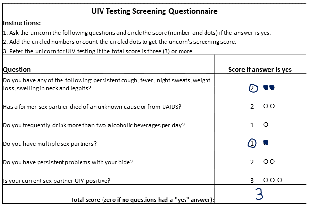

```{r, include = FALSE}
knitr::opts_chunk$set(
  collapse = TRUE,
  comment = "#>"
  )
library(screenr)
data(unicorns)
data(val_data)
```

# Introduction {-}

The screenr package eases the development and validation of
pre-testing screening tools of the sort reviewed by Clemens et al
[1], but is applicable to any test-screening problem. Universal
testing for a condition can be impractical if the test
procedure is relatively expensive and the condition is rare.
Alternatively, testing only those subjects having a sufficiently large
probability of testing positive may be viable if a
screening procedure can be developed which has an acceptable
[sensitivity](https://en.wikipedia.org/wiki/Sensitivity_and_specificity).
That may be possible if easily measured/recorded risk
factors for test positivity can be identified.

This vignette demonstrates the development and validation of such a
screening tool using lasso-like *L*1
[regularization](https://towardsdatascience.com/regularization-in-machine-learning-76441ddcf99a) [2] of logistic
models, as implemented in the glmpath package [3].  The screenr
package also supports maximum-likelihood estimation of logistic model
parameters, but the regularization approach is simpler to use, selects
predictor covariates automatically to prevent over-fitting, is robust to
correlations among the predictors, and handles any separation of
outcomes that might exist for some predictor(s).  Model performance is
evaluated using receiver-operating characteristics [4,5].


# An (Artificial) Example {-}

[Unicorns](https://www.britannica.com/topic/unicorn) suffer an
epidemic of infection by the Unicorn Immunodeficiency Virus (UIV).
There is currently no cure for UIV infection, but highly effective
antiretrovial therapy has the potential to block forward
transmission and to avert death from opportunistic infections
associated with UIV infection.  Therefore it is critical
that UIV infection is detected, and that infected unicorns are
enrolled in treatment.  However, UIV infection is sufficiently rare
that universal testing of unicorns at health-care entry points is
impractical.

A sample of `r dim(unicorns)[1]` properly consented adult unicorns were
enrolled in a study aimed at evidence-based targeting of testing for
UIV infection.  The subjects were administered a
questionnaire identifying the presence or absence of putative risk
factors for UIV infection.  The prevalence of UIV is low, and
therefore universal testing was deemed impractical.  The challenge
then is to identify unicorns who should be prioritized for
testing. Because UIV is transmissible and fatal if left untreated, it is
important that the screening tool have an acceptably high sensitivity.
The screenr package enables development and validation of such
screening tools.

The screening questionnaire included seven questions which were
selected based on published information on infection risk. The data
consists of the responses to the screening questions Q1, ..., Q7
(coded as 1 for an affirmative response and 0 for a negative
response), and the testing outcome (testresult), again coded 0 and 1
for negative and positive results, respectively.

**NOTE:** It is critically important that all of the putative risk
factors have a *positive* association with the outcome.  That is, the
questionnaire must be designed so that affirmative (yes) responses are
hypothesized to indicate an *increased* risk of UIV infection.

The data from the unicorn study look like:

```{r}
## The first six lines of the unicorn screening data:
head(unicorns)
```

The prevalence of UIV in the sample of unicorns is
`r mean(unicorns$testresult, na.rm = TRUE)`. Under universal testing
at health-care entry points, discovery of a single
infection would require, on average, testing
`r round(1 / mean(unicorns$testresult, na.rm =  TRUE))` unicorns.

# Screening Tool Development {-}

Screening-tool development and thorough validation consists of four
steps:

1. Model fitting
2. Selection of a screening threshold
3. External validation on entirely new data
4. Implementation

In practice, unfortunately, the third step is sometimes omitted due to
resource limitations.

## Model fitting

The first step is estimation of the logistic-model parameters from the
training data.  A method known as *L*1 regularization has desirable
properties for that task [2,3].  The function `lasso_screenr()`
provides easy, integrated access to the *L*1 regularization algorithm
of Park and Hastie [3], as implemented in the glmpath R package, using
a convenient formula interface:

```{r}
uniobj1 <- lasso_screenr(testresult ~ Q1 + Q2 + Q3 + Q4 + Q5 + Q6 + Q7,
                         data = unicorns, Nfolds = 10, seed = 123)
class(uniobj1)
```

The formula `testresult ~ Q1 + Q2 + Q3 + Q4 + Q5 + Q6 + Q7` is an
expression of the statement "predict `testresult` from the seven
covariates `Q1`, ..., `Q7`. The argument `Nfolds = 10`
specifies the desired number of partitions (folds) to be used for
cross validation (discussed under 'Selection of a screening
threshold', below).


**NOTE:** The optional `seed` argument specifies the starting value
for the random-number generator used for cross-validation data-splitting. Here
it is set to a fixed value to insure reproducibility. By default, the
seed is set by the system clock, and therefore results will vary from
run to run. Set the seed only if reproducible results are needed.

The fitting algorithm computes logit-scale coefficients along the
entire regularization path, and has the effect of selecting covariates
based on penalization by *L*1-[norm](https://towardsdatascience.com/norms-penalties-and-multitask-learning-2f1db5f97c1f)of their coefficients, similar to
the ordinary lasso [2].  Unlike the lasso, the algorithm also imposes
a very small penalty on the *L*2-norm, which eliminates adverse
effects of any strong correlations among the predictors and provides
useful estimates even if the response variable is separable by the
predictors (albeit unlikely in test-screening applications).  Two
solutions along the regularization path which yield the smallest [AIC
and BIC](https://docs.displayr.com/wiki/Information_Criteria) values,
denoted `"minAIC"` and `"minBIC"`, respectively, are given special
status.  Those are likely the most useful solutions in nearly all
settings. However all solutions are accessible.

The resulting `lasso_screenr`-class object (`uniobj1`) includes the
results from regularization and performance measures from the fits to
all of the data, and from *k*-fold cross validation. The resulting
object, `uniobj1`, contains all of the information need to develop and
(internally) validate a screening tool for diagnostic tests.

For example, the logit-scale coefficients for the special solutions
are obtained using:

```{r}
coef(uniobj1)
```

Note that the coefficients for Q4 have been shrunk to zero in both the
AIC- and BIC-best models, which happen to coincide in the unicorn data.
In effect, Q4 has been eliminated from both of those models. Q4 was
not an important predictor of the test result.

One can also obtain the adjusted odds ratios and/or omit the
intercept.  For example, the adjusted odds ratios for the seven
predictors can be obtained using:

```{r}
coef(uniobj1, or = TRUE, intercept = FALSE)
```

The adjusted odds ratios for Q4 are 1.0, again indicating that Q4 was
not predictive of the test result.

One can also examine the
coefficients everywhere the active set changed along the regularization
path for either of the special fits:

```{r, fig.width = 4, fig.height = 4, fig.fullwidth = TRUE}
pathobj <- get_what(from = uniobj1, what = "glmpathObj", model = "minAIC")
plot(pathobj)
```

where the horizontal axis is the *L*1-norm of the coefficient vector
(see [3] for details).

The screenr package provides the following methods for
`lasso-screenr`-class objects:

```{r}
methods(class = "lasso_screenr")
```

The methods should make it mostly unnecessary to access components of
`lasso_screenr`-class objects directly using R code similar to `object$component`.

## Selection of a screening threshold {-}

The next task is identifying whether sufficiently effective pre-test
screening is possible and, if so, selecting the most appropriate
screening threshold. That task requires careful consideration and
expert judgment, neither of which are provided by the screenr
package. However the screenr package does provide the results that are
most relevant to that task.

The receiver-operating characteristic (ROC) provides measures of the
accuracy of screening at multiple thresholds. The `screenr` package
incorporates
[_k_-fold
cross-validation](https://machinelearningmastery.com/k-fold-cross-validation/)
to estimate the out-of-sample performance using only the training data
(see also 'External validation on entirely new data', below).
The ROC curve is a plot of
sensitivity on the false-positive fraction (1 - specificity) or,
equivalently, plots sensitivity against specificity with specificity plotted
in _decreasing_ order. The ROC curves for the unicorns are displayed
using the R code

```{r, fig.width = 4, fig.height = 4, fig.fullwidth = TRUE}
plot(uniobj1, model = "minAIC")
```

which plots the overly-optimistic in-sample ROC and the
cross-validated out-of-sample ROC from the AIC-best model
fit. Confidence intervals for sensitivity and specificity are plotted
at the local maxima (largest distances perpendicular to the 1:1
line). Those maxima are the complete set options for screening.

The area under the curve (AUC) is 0.9, which is very good compared
with random assignment, which would have an AUC of 0.5. However,
sensitivity and specificity at the local maxima of the ROC curve are
more relevant to test screening.  It is difficult to read
sensitivities and specificities from the ROC curve. Instead, the
numerical values can be obtained using:

```{r}
roc_maximas <- get_what(from = uniobj1, what = "ROCci", se.min = 0.9)
print(roc_maximas)
```

The argument `what = "ROCci"` specifies extraction of the threshold
probabilities of testing positive and cross-validated sensitivities
and specificities along with their 0.95\% confidence limits at the
local maxima along the cross-validated ROC curve. The argument `se.min
= 0.9` limits the local maximas to those which produced a
cross-validated sensitivity estimate of at least 0.90. Here there are
ten options for screening.  For example, testing those unicorns for
which the predicted probability of testing positive is 0.00686 (row 5) or
larger would have an out-of-sample sensitivity of 0.959 and
specificity of 0.628.

For example, suppose we have screening results on two additional
unicorns who have not been tested previously. We can compute their
probabilities of testing positive using the `predict` method for
`lasso_screenr`-class objects:

```{r}
new_corns <- data.frame(ID = c("Alice D.", "Bernie P."),
                        testresult = c(NA, NA),
                        Q1 = c(0, 0), Q2 = c(0, 0), Q3 = c(0, 1),
						Q4 = c(0, 0), Q5 = c(0, 1), Q6 = c(0, 0),
						Q7 = c(0, 0))
new <- predict(uniobj1,  newdata = new_corns )
print(new)
```

If the chosen screening threshold was 0.00686, then testing Bernie P.
but screening out Alice D. would have point estimates of
sensitivity and specificity of 0.959 and 0.628 if the data from those
two unicorns came from the same statistical population as those in the
study data.


## External validation on entirely new data

The estimates of screening performance based on cross-validation using
only the training data will hold for screening on entirely new
subjects if and only if those new subjects are from the same
statistical population as the subjects in the training
sample. However, subjects from other geographic areas, demographic
groups and other health facilities may differ from those in the
training sample. In that case, cross-validated estimates of
sensitivity and specificity might still be overly optimistic.
**Therefore it is highly desirable to validate the
screening tool prior to use in new populations of subjects.**

External validation requires a repetition of the study for the new
population(s). For example, a follow-up study was performed on
unicorns who sought care at facilities that were not represented in
the screening sample. A total of `r dim(val_data)[1]` new unicorns
were interviewed and tested for UIV as part of that follow-up
study. External validation consists of assessment of the performance
of the screening tool on those new subjects.

The `predict` method provides the means to predict test-positivity among
the new subjects:

```{r}
new_preds <- predict(uniobj1, newdata = val_data)
head(new_preds)
```

Note that we are predicting using the model fit from the initial study,
as contained in `uniobj1`. The data frame `val_data` contains the new
data from the follow-up study.

The data frame `new_preds` contains the results of tests from the new
subjects and predicted probabilities of a positive outcome based on
the AIC- and BIC-best models fitted to the training data. The
questionnaire responses from the new subjects are also included. Those
are needed to assess performance of simplified screening based on the
sums of question weights.

The performance of the screening tool when applied to the new subjects
is again measured using the ROC.  The ROC for testing in the new
subjects is obtained using the `roc` function from the `pROC` package:

```{r}
new_roc <- pROC::roc(testresult ~ phat_minAIC, data = new_preds,
auc = TRUE)
class(new_roc)
```

The `pROC` package provides a plot method for `roc`-class objects:

```{r, fig.width = 4, fig.height = 4}
plot(new_roc, print.auc = TRUE)
```

Note that the AUC is slightly smaller than the AUC from
cross-validation of the training data. However the `roc_ci` function
provided by the `screenr` package provides more informative
information, including confidence intervals for sensitivity and
specificity:

```{r}
new_perf <- roc_ci(new_roc, se.min = 0.8)
print(new_perf)
```

## Implementation

There are two basic approaches to implementation of test screening
based on the results from the unicorn study.  The first requires the use of
smartphones or tablets, and the second requires only the ability to count.

### Implementation based on probabilities of testing positive

First, a smartphone or
tablet application could be developed which contains the questionnaire
and code that mimics the functionality of the `predict` method.  The
predicted probability of infection is given by
$$P = \frac{1}{1 + exp(-Xb)}$$
where _X_ is a (design) matrix containing values of 1 in
the first column and the 0/1 question responses in the remaining
columns, and _b_ is a column vector of the estimated logit-scale
coefficients, including the intercept.

The interviewer would enter the responses to the questions and the
application would indicate whether the subject should be referred for
testing based on the internally computed value of _P_. This is the
ideal approach, and should be used wherever possible.

**NOTE:** Screening questions for which estimated coefficients equal 0
(and those zero-valued coefficients) can and should be eliminated from
the screening application.

However, an approach which does not require electronic technology may
be needed in many health-care settings.

### Simplified implementation based on question weights

Alternatively, the non-zero coefficient estimates could be rounded to
whole numbers between 1 and *m*, where *m* is some number from, say, 3
to 10. Those rounded values are used as weights for the question
responses. The score for an individual is the sum of the question
weights.  The choice of *m* involves a trade-off. Small values, say
*m* = 3, make it easy to add-up or tally the scores. However, they will
also result in degraded performance in terms of sensitivity and
specificity. Large values for *m* may approach the performance of
screening based on the predicted probabilities of infection, but
require more difficult additions and therefore are more prone to human
error.

We can explore this strategy for UIV screening in unicorns using the
`easy_tool` function:

```{r}
et_3 <- easy_tool(uniobj1, max = 3, model = "minAIC", crossval = TRUE)
class(et_3)
```
Recall that `uniobj1` contains the results of lasso estimation. The
argument `max` represents *m*, in this case 3. The remaining arguments
specify creation of question weights from the AIC-best model, with
performance base on the cross-validated results in `uniobj1`.  The
resulting object, `et_3`, is of class `easy_tool`.

Methods for that class are found by executing:
```{r}
methods(class = "easy_tool")
```

The question weights can be extracted using the `get_what` method:
```{r}
qwts <- get_what(from = et_3, what = "QuestionWeights")
print(qwts)
```

The decision to use those question weights for screening should be
based on their receiver-operating characteristic. Again, a plot method
is available to display the ROC curve:

```{r, fig.width = 4, fig.height = 4, fig.fullwidth = TRUE}
plot(et_3)
```

Note that the AUC is almost as large as the AUC from the actual model
fit. However there are fewer local maximas, and therefore fewer
choices for screening thresholds. Again, the screening thresholds for
the scores based on the sums of the question weights can be printed:
```{r}
qw_maximas <- get_what(from = et_3, what = "ROCci")
print(qw_maximas)
```

Referral for testing all unicorns having a screening score (threshold)
of 3 or more will have point estimates for sensitivity and specificity
of 0.98 and 0.55, respectively.

A example of a simple clinical screening form based on question
weights is shown in the figure, below.

```{r, fig.width = 4, fig.height = 3}

```

**NOTE:** Screening questions for which the question weights equal 0
can and should be eliminated from the screening form.

# Effects of screening on testing results

How will implementation of that screening tool affect testing? To help
answer that question, we can compute the ratio of total number of
tests performed to the anticipated number of positive test results and
the anticipated prevalence among those who are screened *out* of
testing.  Effective screening will greatly
reduce the prevalence among those who are screened out of testing and
will have high sensitivity. Efficient screening will reduce the ratio of numbers of
tests to positive test results.
Both measures are obtained by using the `ntpp` (number of tests per
positive) function:

```{r}
ntpp(et_3)
```

After screening out unicorns having score less than 3 (row 4, as
identified by sensitivity and specificity), the prevalence of UIV
among the *untested* should be approximately 0.0006 (0.06\%). In
contrast, the prevalence of UIV among all subjects in the training
data is `r (pbar <- round(mean(unicorns$testresult, na.rm = TRUE),
digits = 4))`.

The ratio of total tests to positive results is 28.7 when testing
unicorns with a score of at least 3. Without screening, in contrast,
an average of approximately
`r round(1/pbar, digits = 1)` would need to be tested in order to
detect a single
infection.


# Epilogue

The `screenr` package eases the workload for development and
evaluation of screening tools. Hopefully `screenr` will prove useful
to both novice and experienced R users. This tutorial documents only
the basic steps. However much more is possible. Execute
`help(screenr)` in an R session to obtain a broader list of
capabilities. End-users are encouraged to further explore the methods
that are available for objects. Make use of the R commands
`class(some_object)` and `methods(class = "some_class")` where
`some_object` is the result of some function call, and `"some_class"`
is the class of that object. Then use `help(methodname.some_class)` to
obtain help for use of method `methodname`.

Some may want results that are not directly available from `screenr`
functions and methods. In those cases, the `get_what` methods may
provide an easy way to extract the results contained in the objects
produced by, for example, the `glmpath::glmpath` and `pROC::roc`
functions. However, experienced R users may also use
`str(some_object)` to identify other components for extraction using
the idiom `some_object$some_component`.

# References {-}

1. Clemens SL, Macneal KD, Alons CL, Cohn JE. Screening algorithms to
reduce burden of pediatric HIV testing: A systematic review and
meta-analysis. The Pediatric Infectious Disease Journal. 2020;
39(10):e303-e309. DOI: 10.1097/INF.0000000000002715.

2. Hastie T, Tibshirani R, Friedman R. The Elements of Statistical
   Learning. Springer, New York. 2009.  DOI: 10.1007/b94608.

3. Park MY, Hastie T. *L*1-regularization path algorithm for
   generalized linear models. Journal of the Royal Statistical Society
   Series B. 2007; 69(4):659-677. DOI: 10.1111/j.1467-9868.2007.00607.x

4. Linden A. Measuring diagnostic and predictive accuracy in disease
   management: an introduction to receiver operating characteristic
   (ROC) analysis. Journal of Evaluation in Clinical Practice. 2006;
   12(2):132-139. DOI: 10.1111/j.1365-2753.2005.00598.x

5. Fawcett T. An introduction to ROC analysis.  Pattern Recognition
   Letters. 2006; 27(8):861-874. DOI: 10.1016/j.patrec.2005.10.010.

6. Robin X, Turck N, Hainard A, Tiberti N, Lisacek F, Sanchez J-C,
   Müller M. pROC: an open-source package for R and S+ to analyze and
   compare ROC curves. BMC Bioinformatics. 2011; 12(77):1-8. DOI:
   10.1186/1471-2105-12-77.
